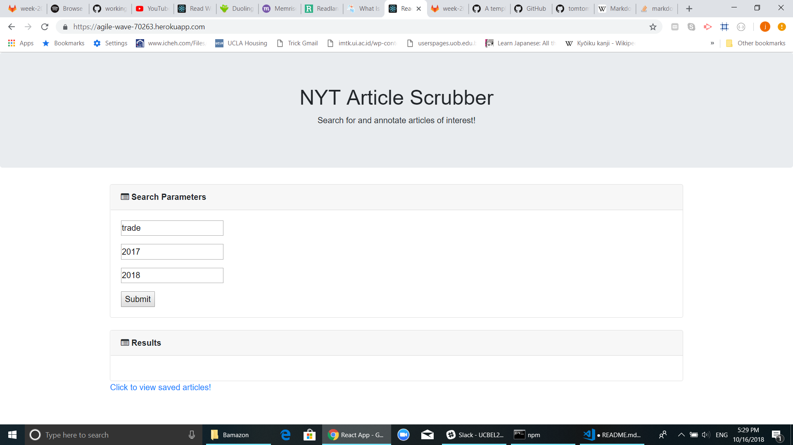
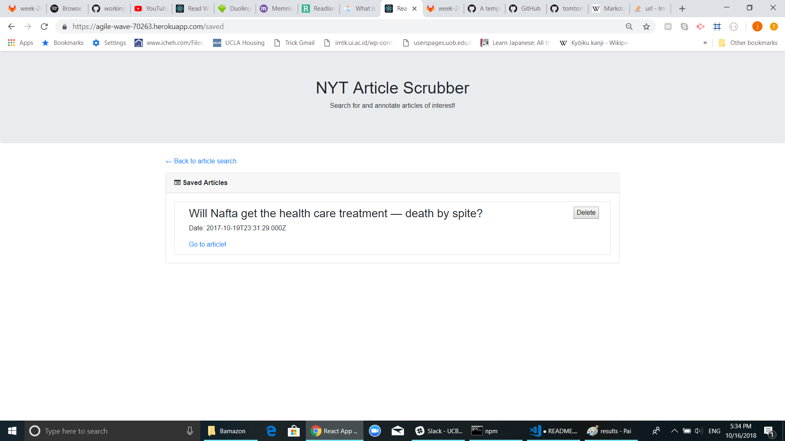

# NYT Scrubber
A Node, Express, MongoDB, and ReactJS application where users can query, display, and save articles from the New York Times Article Search API.

## Starting the app locally
A fully functional version of this project has been deployed to heroku and can be accessed here: 
https://agile-wave-70263.herokuapp.com/

If you instead wish to start the app on your local machine, simply `cd` into the project repo and run `yarn install` to install dependencies, followed by `yarn start`.

## Screenshots

